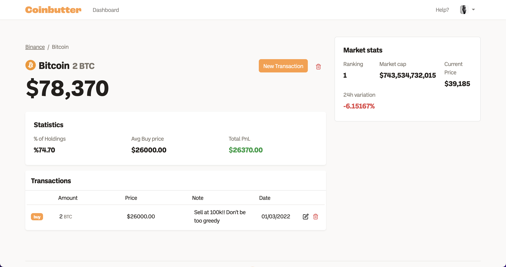

# coinbutter

## Introduction 

For our second project in our awesome IronHack journey, we decided to create our own portfolio value tracker. Sometimes it's hard to know exactly how much your assets worth when you have multiple wallets or exhanges platform. 

## Features

The main features are : 

- Email profile activation

- Edit your profile, add a picture

- Auto updating coins statistiques with a CRON

- Having multiple portfolios and be able to see the overview of it

    

- Track the value of each asset inside a portfolio with all it's statistic (ie PnL or Average Buy Price)

    

- Update or Delete old transactions

## Setup

If you'd like to view my project in your browser:

-  `git clone https://github.com/Rachouan/coinbutter` in your terminal
-  `cd coinbutter`
-  `code .`

Then to run it locally:

- `npm install`
- `npm run dev`

Also it's deployed on: www.coinbutter.co

## Technologies used

- HBS & Express
- NodeJs
- Javascript
- SCSS & HTML
- Sendgrid
- CoinGecko API
- Cloudinary API
- Heroku
- MongoDB

## More Features ?

There is features we would have add with more time, to make it even more fit our needs as Crypto Enthusiasts.
- Binance API to update automatically transactions users make
- Switch Portfolio & Assets currency in BTC
- Graph of value over time for coins, assets & portolios
- Dark Mode

## Team Members

This project was made by [Rachouan Rejeb](https://github.com/rachouan) and [Corentin Aesch](https://github.com/CorentinAesch).